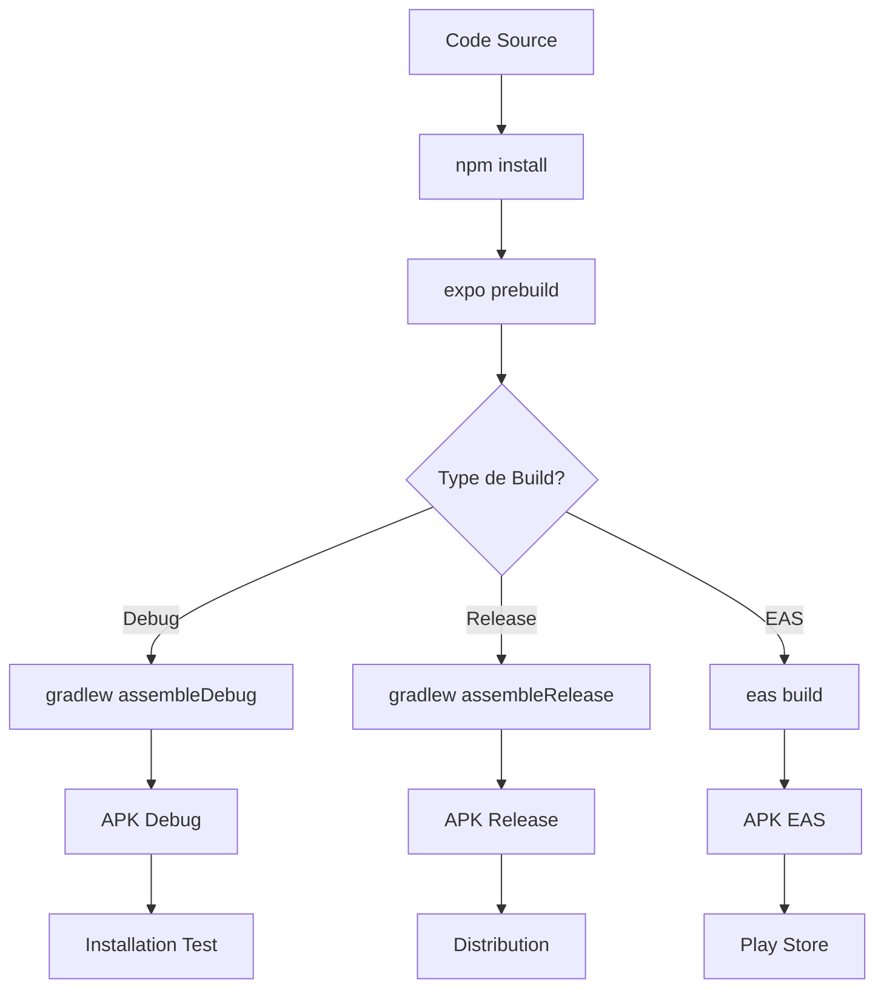

# 📱 Guide de Génération d'APK - EduTeQC

## 🎯 Vue d'ensemble

Ce guide vous explique comment générer un fichier APK (Android Package) de votre application EduTeQC pour l'installer sur des appareils Android.

## 🛠️ Méthodes Disponibles

### 📱 Méthode 1 : APK Debug (Développement)

**Utilisation** : Tests internes, développement, démonstration

```powershell
# 1. Aller dans le dossier mobile
cd mobile

# 2. Générer les fichiers natifs Android (si pas déjà fait)
npx expo prebuild --platform android

# 3. Générer l'APK debug en spécifiant le répertoire de travail
Set-Location "C:\Projet\EduTeQCV2\mobile\android"; .\gradlew.bat assembleDebug
```

**Fichier généré** : `mobile/android/app/build/outputs/apk/debug/app-debug.apk`

### 🚀 Méthode 2 : APK Release (Production)

**Utilisation** : Distribution publique, Play Store

```powershell
# 1. Générer l'APK release en spécifiant le répertoire de travail
Set-Location "C:\Projet\EduTeQCV2\mobile\android"; .\gradlew.bat assembleRelease
```

**Fichier généré** : `mobile/android/app/build/outputs/apk/release/app-release.apk`

### ☁️ Méthode 3 : EAS Build (Cloud)

**Utilisation** : Build professionnel, signature automatique

```powershell
# 1. Installer EAS CLI (si pas déjà fait)
npm install -g eas-cli

# 2. Se connecter à Expo
eas login

# 3. Configurer le projet (première fois)
eas build:configure

# 4. Générer l'APK
eas build --platform android --profile preview
```

## 📁 Localisation des APK

### APK Debug
```
mobile/android/app/build/outputs/apk/debug/app-debug.apk
```

### APK Release
```
mobile/android/app/build/outputs/apk/release/app-release.apk
```

### APK EAS Build
Les APK générés via EAS sont téléchargeables depuis l'interface web d'Expo.

## ⚙️ Configuration

### Fichier `app.json`
```json
{
  "expo": {
    "name": "EduTeQC",
    "slug": "eduteqc",
    "version": "1.0.0",
    "android": {
      "package": "com.eduteqc.app",
      "versionCode": 1
    }
  }
}
```

### Fichier `eas.json`
```json
{
  "build": {
    "preview": {
      "android": {
        "buildType": "apk"
      }
    },
    "production": {
      "android": {
        "buildType": "app-bundle"
      }
    }
  }
}
```

## 🔐 Signature d'Application

### APK Debug
- **Signature** : Automatique (debug keystore)
- **Installation** : Directe sur appareils de développement
- **Distribution** : Tests internes uniquement

### APK Release
- **Signature** : Keystore de production requis
- **Installation** : Nécessite activation "Sources inconnues"
- **Distribution** : Possible en dehors du Play Store

### APK EAS Build
- **Signature** : Gérée automatiquement par Expo
- **Installation** : Prête pour distribution
- **Distribution** : Compatible Play Store

## 📋 Checklist Avant Build

### ✅ Vérifications Obligatoires

1. **Backend démarré** : Serveur API accessible
2. **Dépendances installées** : `npm install` dans `mobile/`
3. **Configuration API** : URLs correctes dans `services/api.ts`
4. **Permissions Android** : Déclarées dans `app.json`
5. **Version mise à jour** : Incrémenter `versionCode` si nécessaire

### ⚠️ Paramètres Critiques

```typescript
// mobile/src/services/api.ts
const API_BASE_URL = 'http://YOUR_SERVER_IP:3000/api';
```

**Important** : Remplacer `localhost` par l'IP réelle du serveur pour les tests sur appareil physique.

## 🐛 Résolution de Problèmes

### Erreur : "expo command not found"
```powershell
npm install -g @expo/cli
```

### Erreur : "Android SDK not found"
```powershell
# Installer Android Studio
# Configurer ANDROID_HOME dans les variables d'environnement
```

### Erreur : "gradlew command not found"
```powershell
# Utiliser le chemin complet au lieu du chemin relatif
C:\Projet\EduTeQCV2\mobile\android\gradlew.bat assembleDebug
```

### APK ne s'installe pas
1. Activer "Sources inconnues" dans les paramètres Android
2. Vérifier la signature de l'APK
3. Désinstaller la version précédente si conflit

## 📱 Installation sur Appareil

### Méthode 1 : ADB (Développement)
```powershell
# Connecter l'appareil en USB avec débogage USB activé
adb install mobile/android/app/build/outputs/apk/debug/app-debug.apk
```

### Méthode 2 : Transfert Direct
1. Copier l'APK sur l'appareil (USB, Bluetooth, cloud)
2. Ouvrir le gestionnaire de fichiers
3. Appuyer sur le fichier APK
4. Autoriser l'installation depuis "Sources inconnues"

### Méthode 3 : QR Code (EAS Build)
1. Scanner le QR code généré par EAS
2. Télécharger et installer automatiquement

## 📊 Comparaison des Méthodes

| Méthode | Temps | Complexité | Qualité | Usage |
|---------|-------|------------|---------|--------|
| Debug Local | ⚡ Rapide | 🟢 Simple | 🟡 Développement | Tests internes |
| Release Local | ⚡ Rapide | 🟡 Moyen | 🟢 Production | Distribution directe |
| EAS Cloud | 🐌 Lent | 🟢 Simple | 🟢 Professionnelle | Distribution publique |

## 🎯 Recommandations

### Pour le Développement
- Utiliser **APK Debug** pour les tests rapides
- Garder le serveur backend en local
- Utiliser `adb install` pour l'installation

### Pour la Démonstration
- Utiliser **APK Release** pour une meilleure performance
- Configurer l'API vers un serveur accessible
- Tester sur plusieurs appareils

### Pour la Production
- Utiliser **EAS Build** pour la signature professionnelle
- Configurer un serveur de production
- Préparer pour le Play Store

## 🔄 Workflow Complet



## 📞 Support

En cas de problème :
1. Vérifier les logs de build dans le terminal
2. Consulter la documentation Expo : https://docs.expo.dev
3. Vérifier la configuration Android SDK
4. Tester avec un APK debug d'abord

---

*Généré pour EduTeQC - Application d'apprentissage mobile*